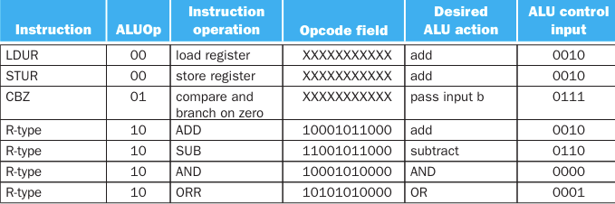

# ARM LEGv8 Processor in Verilog

  

A simplified ARMv8 "processor". The processor is based on the architecture from 'Computer Organization and Design ARM Edition' by David A. Patterson and John L. Hennessy.  

# Olivia Rodrigo Assembly Language
TODO: add instructions here lol

# Architecture Information
__Doubleword__: Group of 64 bits.    
__Word__: Group of 32 bits.  

LEGv8 architecture is 64 bits.   
__Instruction format__: Each instruction takes exactly one word.  
__Registers__: 64 bits x 32 registers.   
__Memory__: LEGv8 uses byte addressing, with each doubleword representing 64 bits (8 bytes). There are two memories: instruction memory and data memory.    
__Instruction Memory__: 8 bits x 64 registers, i.e., 64 bytes. Since each instruction (32 bits) is 4 bytes, the instruction memory can hold 16 instructions. Although we only have 64 registers, thus needing only 6 bits to represent the address space, we will use 64 bits for consistency with the full ARMv8 architecture.  
__Data Memory__: 64 bits (8 bytes) x 128 registers = 1024 bytes of data.

## verilog_refreshers
A folder with various verilog modules for practice.

## Prerequisites
- Download and install [Icarus Verilog](https://bleyer.org/icarus/).
- Download and install [GTKWave](http://gtkwave.sourceforge.net/)

## Running
- Run using makefile OR     
`iverilog -o ARM olivia.v`  
`vvp ARM`    
`gtkwave olivia.v`

## Introduction
### Datapath with control unit  

### Pipeline and stages

## Instructions (Basic)
### R-Format Instructions
| opcode: 11 bits | Rm: 5 bits | shamt: 6 bits | Rn: 5 bits | Rd: 5 bits |
- Opcode: operation code
- Rm: second register source operand
- shamt: shift amount (0000 for now)
- Rn: first register source operand
- Rd: register destination

### D-Format Instructions
| opcode: 11 bits | address: 9 bits | op2: 2 bits | Rn: 5 bits | Rt: 5 bits |   
__Load/Store Instructions__:
- address: constant offset from contents of base register Rn (+/- 32 doublewords).
- Rn : base register
- Rt: destination (load) or source (store) register number

### I-Format Instructions
| opcode: 10 bits | immediate: 12 bits | Rn: 5 bits | Rd: 5 bits |  
__Immediate Instructions (ADDI, SUBI):__    
- Rn: source register
- Rd: destination register  
- Immediate field is zero-extended   

### Supported Instructions
     
Also `NOP` -- Make the processor wait one cycle.

### Control Signals  

### Instructions Types With Control Signals

## Program Counter
The PC uses the Instruction Memory to fetch a 32 bit instruction at each cycle. 4 registers of 8 bits are read in big-endian order.

## Registers
LEGv8 has 32 x 64-bit register file with 31 being genreal purpose registers X0 to X30.  
X0 – X7: procedure arguments/results    
X8: indirect result location register   
X9 – X15: temporaries   
X16 – X17 (IP0 – IP1): may be used by linker as a scratch register, other times as temporary register   
X18:  platform register for platform independent code; otherwise a temporary register   
X19 – X27: saved    
X28 (SP): stack pointer 
X29 (FP): frame pointer 
X30 (LR): link register (return address)    
XZR (register 31): the constant value 0     
*NOTE: Temporary vs saved registers: No difference in how they work but rather how they ought to be used. Temporaries are caller saved registers, while saved registers are callee saved. In other words, when calling a function, the convention guarantees that the saved registers are the same after return wheras the convention does not guarantee this for the temporary registers.*

## Testing
### Registers Initialized With Some Values
TODO: Add initializers here

### Instruction Memory Initialized With Instructions
TODO: This is temporary and should adjust to register initialization.
| Line # | ARM Assembly         | Machine Code                             | Hexadecimal  |
|--------|----------------------|------------------------------------------|--------------|
| 1      | `LDUR r2, [r12]`       | 1111 1000 0100 0000 0000 0001 1000 0010  | 0xf8400182   |
| 2      | `LDUR r3, [r13]`       | 1111 1000 0100 0000 0000 0001 1010 0011  | 0xf84001a3   |
| 3      | `ORR x5, x20, x1`      | 1010 1010 0000 0001 0000 0010 1000 0101  | 0xaa010285   |
| 4      | `AND x6, x28, x27`     | 1000 1010 0001 1011 0000 0011 1000 0110  | 0x8a1b0386   |
| 5      | `NOP`                  | 0000 0000 0000 0000 0000 0000 0000 0000  | 0x00000000   |
| 6      | `ADD x9, x3, x2`       | 1000 1011 0000 0010 0000 0000 0110 1001  | 0x8b020069   |
| 7      | `SUB x10, x3, x2`      | 1100 1011 0000 0010 0000 0000 0110 1010  | 0xcb02006a   |
| 8      | `CBZ x6, #13`          | 1011 0100 0000 0000 0000 0001 1010 0110  | 0xb40001a6   |
| 9      | `NOP`                  | 0000 0000 0000 0000 0000 0000 0000 0000  | 0x00000000   |
| 10     | `SUB X11, x9, x3`      | 1100 1011 0000 0011 0000 0001 0010 1011  | 0xcb03012b   |
| 11     | `AND x9, x9, x10`      | 1000 1010 0000 1010 0000 0001 0010 1001  | 0x8a0a0129   |
| 12     | `STUR x5, [x7, #1]`    | 1111 1000 0000 0000 0001 0000 1110 0101  | 0xf80010e5   |
| 13     | `AND x3, x2, x10`      | 1000 1010 0000 1010 0000 0000 0100 0011  | 0x8a0a0043   |
| 14     | `ORR x21, x25, x24`    | 1010 1010 0001 1000 0000 0011 0011 0101  | 0xaa180335   |
| 15     | `B #20`                | 0001 0100 0000 0000 0000 0000 0001 0100  | 0x14000014   |
